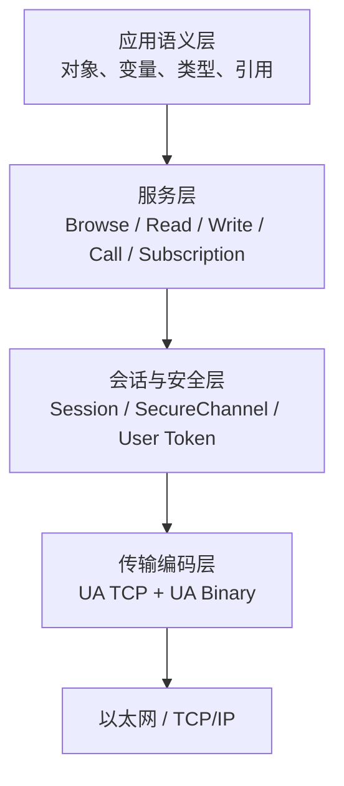
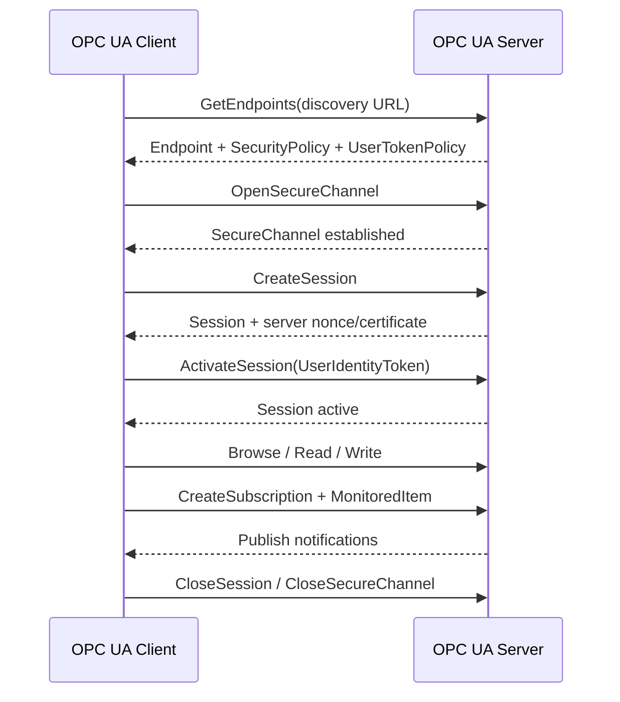
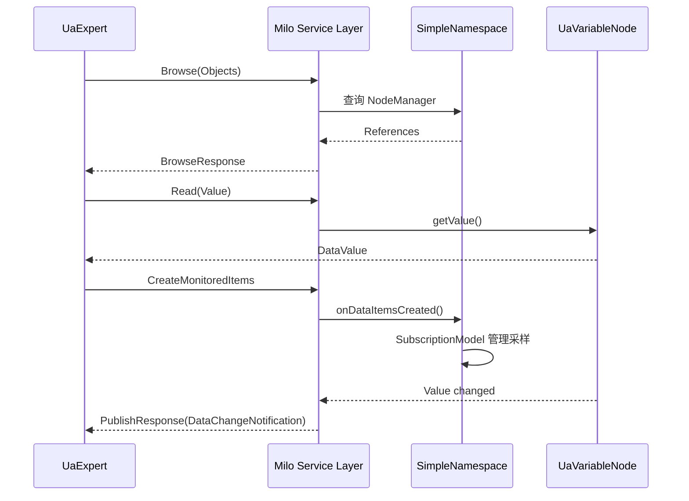
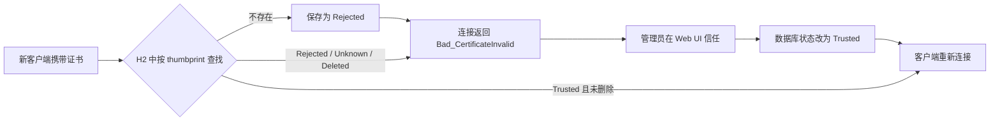
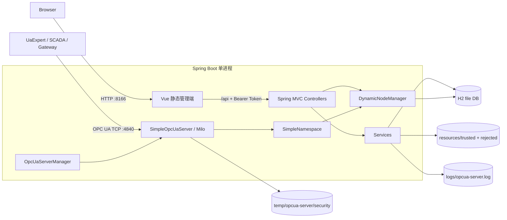
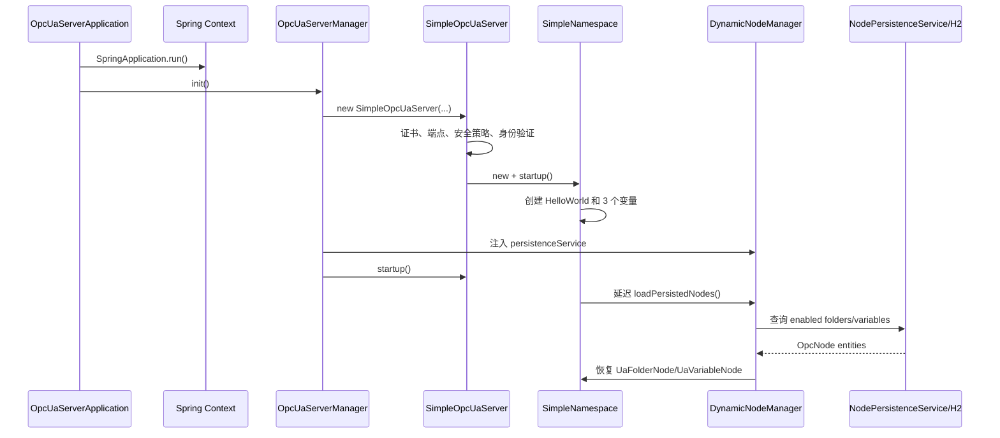
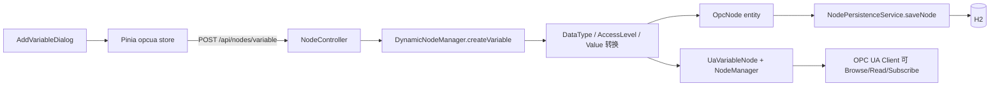
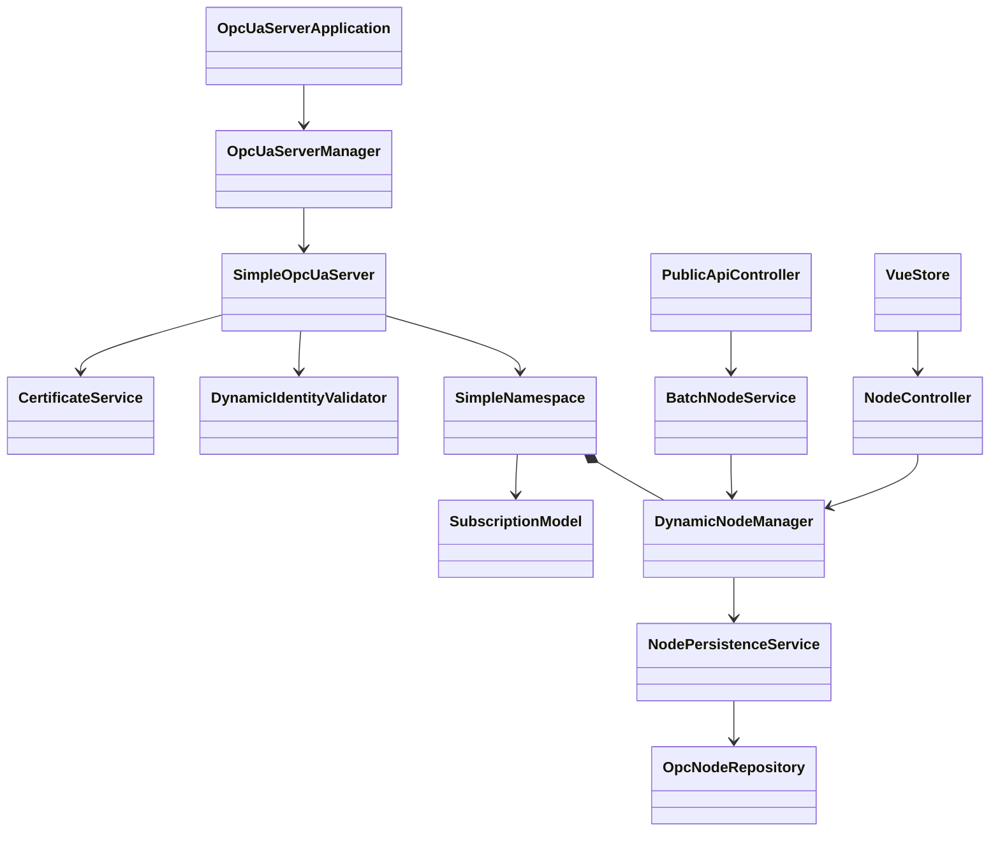

# OPC UA 从入门到实战：OPCUA-Server 源码学习指南

> 文档基线：2026-07-20 工作区源码  
> 项目：Java 17 + Spring Boot 3.1.5 + Eclipse Milo 1.0.0 + Vue 3 + H2  
> 阅读目标：一边建立 OPC UA 心智模型，一边知道这些概念在本项目的哪段代码中落地。

---

## 目录

1. [先用 10 分钟建立全局认识](#1-先用-10-分钟建立全局认识)
2. [OPC UA 到底解决什么问题](#2-opc-ua-到底解决什么问题)
3. [信息模型：把设备变成可浏览的知识图谱](#3-信息模型把设备变成可浏览的知识图谱)
4. [通信模型：从发现端点到订阅数据](#4-通信模型从发现端点到订阅数据)
5. [安全模型：证书、SecureChannel 与用户身份](#5-安全模型证书securechannel-与用户身份)
6. [本项目总体架构](#6-本项目总体架构)
7. [启动链路与核心类](#7-启动链路与核心类)
8. [地址空间与动态节点源码导读](#8-地址空间与动态节点源码导读)
9. [Web、REST、Milo 与 H2 的数据流](#9-webrestmilo-与-h2-的数据流)
10. [实战一：启动项目并用 UaExpert 订阅](#10-实战一启动项目并用-uaexpert-订阅)
11. [实战二：用 Web UI 管理节点](#11-实战二用-web-ui-管理节点)
12. [实战三：用 REST API 自动建点](#12-实战三用-rest-api-自动建点)
13. [实战四：验证持久化与证书信任](#13-实战四验证持久化与证书信任)
14. [二次开发：接入真实设备数据](#14-二次开发接入真实设备数据)
15. [核心功能与能力边界](#15-核心功能与能力边界)
16. [源码观察、风险与生产化清单](#16-源码观察风险与生产化清单)
17. [常见问题排查](#17-常见问题排查)
18. [源码阅读路线与术语速查](#18-源码阅读路线与术语速查)

---

## 1. 先用 10 分钟建立全局认识

### 1.1 一句话理解 OPC UA

OPC UA（OPC Unified Architecture）是一套面向工业互操作的标准：它不仅规定“怎样传输一个温度值”，还规定怎样描述这个值的名称、类型、单位、层级关系、访问权限、安全策略，以及客户端如何浏览、读取、写入和订阅它。

把它类比成 Web：

| Web 世界 | OPC UA 世界 | 本项目中的位置 |
| --- | --- | --- |
| 域名和 URL | Discovery URL、Endpoint URL | `SimpleOpcUaServer.java:226` |
| TLS 连接 | SecureChannel + SecurityPolicy | `SimpleOpcUaServer.java:316` |
| 登录会话 | Session + UserIdentityToken | `DynamicIdentityValidator.java:75` |
| REST 资源 | 地址空间里的 Node | `SimpleNamespace.java:77` |
| JSON 字段 | Node Attribute | `DynamicNodeManager.java:778` |
| WebSocket 推送 | Subscription + MonitoredItem | `SimpleNamespace.java:192` |

这个类比只帮助入门：OPC UA 是有状态的工业通信协议，信息模型、服务集合和安全机制都比普通 REST 更严格。

### 1.2 这个项目是什么

本项目把两套入口放进同一个 Spring Boot 进程：

- 工业客户端通过 `opc.tcp://localhost:4840/milo` 访问 Eclipse Milo OPC UA Server。
- 管理人员通过 `http://localhost:8166` 使用 Vue Web UI。
- Web UI 经 REST API 操作 Milo 内存地址空间，并把动态节点写入 H2。
- 服务重启后，持久化节点重新加载进地址空间。

因此它不是单纯的 Milo 示例，也不是完整商业服务器，而是一个“可视化管理的 OPC UA Server 工程骨架”。

### 1.3 推荐学习路线

- **30 分钟理解**：读第 2～7 章，再看第 15 章能力矩阵。
- **半天上手**：读到第 13 章并完成 UaExpert、Web UI、REST 三组实验。
- **准备二开**：重点读第 8、9、14、16 章，然后按第 18 章路线阅读源码。

---

## 2. OPC UA 到底解决什么问题

### 2.1 从 OPC Classic 到 OPC UA

早期 OPC Classic 依赖 Windows COM/DCOM，跨平台、穿越防火墙和安全部署都比较困难。OPC UA 重新设计了协议栈和信息模型：

- 跨平台、跨语言，不绑定 COM/DCOM。
- 自带应用认证、消息签名和加密模型。
- 不只是数据点列表，而是带类型和引用的地址空间。
- 同时支持实时读写、订阅、方法、事件、历史等服务族。
- 规范与传输解耦；本项目使用最常见的 UA TCP 二进制传输。

### 2.2 三层心智模型



在本项目里：

- 语义层主要在 `SimpleNamespace` 和 `DynamicNodeManager`。
- 服务层大部分由 Milo Server SDK 提供，本项目注册节点和订阅回调。
- 安全层在 `SimpleOpcUaServer`、`DynamicIdentityValidator` 和证书服务。
- 传输端点由 `SimpleOpcUaServer.buildTcpEndpoint()` 绑定到 4840。

### 2.3 标准、SDK 和项目各负责什么

| 层级 | 责任 | 例子 |
| --- | --- | --- |
| OPC UA 标准 | 定义数据模型、服务、状态码、安全规则 | NodeClass、Browse、Session、Bad_NodeIdUnknown |
| Eclipse Milo | 实现协议编解码、服务分发、节点模型、订阅框架 | `OpcUaServer`、`UaVariableNode`、`SubscriptionModel` |
| 本项目 | 配置服务器、组织节点、接 Web 管理、持久化和认证数据 | `SimpleOpcUaServer`、`DynamicNodeManager`、Controllers |

阅读源码时最容易犯的错误，是看到客户端能 Browse/Read 就以为项目手写了这些协议。本项目主要做的是**配置和扩展 Milo**；真正的 OPC UA 报文处理由 Milo 完成。

---

## 3. 信息模型：把设备变成可浏览的知识图谱

### 3.1 Address Space（地址空间）

地址空间是服务器公开的节点图。客户端通常从标准 `Root`、`Objects`、`Types` 等节点开始 Browse。本项目把业务节点组织在 `Objects` 下：

```text
Objects
├─ Server                     # OPC UA 标准服务器对象
├─ HelloWorld                 # 源码内置示例
│  ├─ Temperature             # 每秒变化
│  ├─ Pressure
│  └─ Humidity
└─ 通过 Web/API 创建的动态目录与变量
```

`HelloWorld` 由 `SimpleNamespace.createAndAddNodes()` 创建（`SimpleNamespace.java:77`）；动态节点由 `DynamicNodeManager` 管理，并在启动时从 H2 恢复（`DynamicNodeManager.java:53`）。

### 3.2 Node 与 NodeClass

Node 是信息模型的基本单元，NodeClass 表示它属于哪一类：

| NodeClass | 用途 | 本项目 |
| --- | --- | --- |
| Object | 表示设备或逻辑实体 | 标准 `Server` 对象 |
| Variable | 表示可读写或可订阅的数据 | `UaVariableNode`，完整使用 |
| Method | 表示可调用操作 | 未见业务 Method 节点 |
| ObjectType | 定义对象模板 | 使用标准类型，未建自定义类型模型 |
| VariableType | 定义变量模板 | 使用标准 `BaseDataVariableType` |
| ReferenceType | 定义关系语义 | 使用 `Organizes` 等标准引用 |
| DataType | 定义值类型 | 使用标准内置数据类型 |
| View | 地址空间的过滤视图 | 未见业务实现 |

本项目 Web UI 中的“文件夹”实际是 Milo 的 `UaFolderNode`；“变量”是 `UaVariableNode`。这是一种易管理的树形简化，但 OPC UA 地址空间本质是**有向图**，一个节点可以通过多条 Reference 与其他节点关联。

### 3.3 NodeId、BrowseName、DisplayName 不要混淆

| 字段 | 作用 | 是否唯一 |
| --- | --- | --- |
| NodeId | 服务器地址空间内的机器标识 | 是 |
| BrowseName | 浏览路径中的限定名称，包含 NamespaceIndex | 同一父关系下应可区分 |
| DisplayName | 给人看的本地化名称 | 否 |
| Description | 解释文本 | 否 |

NodeId 由 NamespaceIndex 和 Identifier 组成，常见写法：

```text
ns=2;s=Line1/Motor/Speed    # String
ns=2;i=1001                 # Numeric
ns=2;g=550e8400-e29b-41d4-a716-446655440000  # GUID
ns=2;b=AQIDBA==             # Opaque/ByteString
```

本项目的动态管理器支持 string、numeric、guid、opaque 四类标识，并从 1000 开始生成数字 ID（`DynamicNodeManager.java:34`、`:1000`、`:1065`）。前端传的是业务 `path`，管理器再把它变成真正 NodeId。**不要把 `HelloWorld/Temperature` 这样的业务路径当成 OPC UA 标准路径语法**；它是本项目建立的映射约定。

### 3.4 Namespace URI 与 NamespaceIndex

Namespace 防止不同厂商或模型之间命名冲突：

- URI 是稳定身份，例如本项目 `urn:example:simple-opcua-server`。
- Index 是某次服务器运行中 NamespaceTable 的短编号，如 `ns=2`。
- 客户端不应永久假设 URI 总是对应某个固定 index；稳健客户端应通过 NamespaceArray 解析。

源码位置：`SimpleNamespace.NAMESPACE_URI` 位于 `SimpleNamespace.java:28`，构造器将其注册给 Milo（`:41`）。

### 3.5 Attribute 与 DataValue

Variable 常用 Attribute：NodeId、NodeClass、BrowseName、DisplayName、DataType、ValueRank、AccessLevel、UserAccessLevel、Value。Read 服务读取的不只是裸值，而是 `DataValue`：

```text
DataValue
├─ Value: Variant(25.0)
├─ StatusCode: Good / Bad_...
├─ SourceTimestamp: 数据源产生时间
└─ ServerTimestamp: 服务器处理时间
```

本项目 `HelloWorld` 用 `new DataValue(new Variant(...))` 设置初值（`SimpleNamespace.java:111` 等），每秒更新时也写入时间戳（`SimpleNamespace.java:168`）。动态节点根据请求中的 `dataType` 转成 Milo DataType NodeId 和 Java 值（`DynamicNodeManager.java:897`、`:917`）。

### 3.6 Reference：树只是图的一种展示

常见引用：

- `Organizes`：文件夹组织成员，本项目广泛使用。
- `HasComponent`：对象由组件组成，语义比 Organizes 更强。
- `HasProperty`：对象或变量的属性。
- `HasTypeDefinition`：实例属于哪个类型。

本项目的内置变量通过 `rootNode.addOrganizes(variable)` 建立关系（`SimpleNamespace.java:113`）。动态管理器也能通过 `/api/nodes/references` 返回引用信息（`NodeController.java:402`、`DynamicNodeManager.java:1136`）。

---

## 4. 通信模型：从发现端点到订阅数据

### 4.1 一次连接经历什么



需要区分三个对象：

- **Endpoint**：客户端可选择的连接方案，包含 URL、消息安全模式、安全策略和用户令牌策略。
- **SecureChannel**：保护消息交换，生命周期较短，可续期。
- **Session**：应用层会话，绑定用户身份，承载 Browse/Read/Write/Subscription。

### 4.2 Browse、Read、Write

- Browse 返回引用和目标节点摘要，不等同于递归读取整棵树。
- Read 可以批量读取多个节点的多个 Attribute。
- Write 写的是 Attribute；最常见是写 Variable 的 Value。
- 服务器用 StatusCode 表示每个操作结果，而不只是连接级成功/失败。

本项目的 OPC UA Browse/Read/Write 服务由 Milo 提供；项目负责向 Milo NodeManager 注册可访问节点。Web UI 走的是另一条 REST 管理通道，不是把 OPC UA 报文转发到浏览器。

### 4.3 Subscription 与 MonitoredItem

轮询 Read 是“客户端不断问”；Subscription 是“客户端创建订阅，服务器按 Publish 机制发送通知”。层次为：

```text
Session
└─ Subscription（publishing interval、lifetime、keep-alive）
   ├─ MonitoredItem: Temperature（sampling interval、queue、filter）
   └─ MonitoredItem: Pressure
```

几个容易混淆的时间：

- Sampling Interval：服务器采样监控项的频率。
- Publishing Interval：订阅整理通知并尝试发布的频率。
- 客户端必须持续发送 PublishRequest；不是服务器任意向客户端开新连接推送。
- QueueSize 决定客户端来不及消费时能保留多少变化。

本项目在 `SimpleNamespace.java:32` 创建 `SubscriptionModel`，并把 DataItem 创建、修改、删除以及 MonitoringMode 变化回调全部委托给它（`:192-208`）。`HelloWorld` 每秒更新，天然适合订阅实验。

### 4.4 服务交互与项目代码



---

## 5. 安全模型：证书、SecureChannel 与用户身份

### 5.1 两种身份不要混淆

OPC UA 通常有两层认证：

1. **应用实例身份**：客户端和服务器用 X.509 Application Instance Certificate 证明“我是哪个应用”。
2. **用户身份**：Session 激活时用 Anonymous、UserName、X509 或 IssuedToken 证明“当前操作者是谁”。

证书信任通过 SecureChannel 之前就可能失败；用户名密码错误发生在 ActivateSession 阶段。排错时要先分清层次。

### 5.2 MessageSecurityMode 与 SecurityPolicy

| 概念 | 作用 |
| --- | --- |
| None | 不签名、不加密，只适合受控实验环境 |
| Sign | 消息签名，防篡改和伪造；内容仍可见 |
| SignAndEncrypt | 签名并加密，通常是生产首选 |
| SecurityPolicy | 指定算法组合、密钥长度、摘要与加密规则 |

本项目在 `SimpleOpcUaServer.java:320-352` 直接列出了 None、Basic128Rsa15、Basic256、Basic256Sha256、Aes128_Sha256_RsaOaep、Aes256_Sha256_RsaPss 的多种组合。旧的 Basic128Rsa15/Basic256 已不适合新生产系统，优先使用 Basic256Sha256 或 AES 系列，并结合客户端兼容性验证。

### 5.3 项目证书信任流程



关键实现位于 `SimpleOpcUaServer.java:118-175`：自定义验证逻辑从证书链取客户端证书，用 `CertificateService` 查状态；新证书保存后拒绝本次连接，要求管理员信任后重连。

运行时服务器密钥与 PKI 位于系统临时目录的 `opcua-server/security`（`SimpleOpcUaServer.java:81-105`）。另一方面，`CertificateService` 还扫描源码目录 `src/main/resources/trusted` 和 `rejected`（`CertificateService.java:43-44`）。两套目录不是同一个信任存储，需要在生产化前统一设计。

### 5.4 UserTokenPolicy 与动态身份验证

`SimpleOpcUaServer.createTokenPolicies()` 向端点声明用户令牌策略；`DynamicIdentityValidator` 再根据 H2 中认证方式开关和用户表验证 Anonymous/UserName 等身份（`DynamicIdentityValidator.java:45-65`、`:75-131`）。

源码中用户名令牌策略显式使用 `SecurityPolicy.None`（`SimpleOpcUaServer.java:286-293`）。这不等于连接必然明文，因为它还受端点 SecureChannel 保护；但在 `None/None` 端点上使用用户名密码存在严重泄露风险。生产环境应禁用 None 端点或禁止其 UserName token，并实际抓包/互操作验证策略。

---

## 6. 本项目总体架构

### 6.1 总体架构图



### 6.2 技术栈

| 层 | 技术 | 源码依据 |
| --- | --- | --- |
| OPC UA | Eclipse Milo Server 1.0.0 | `pom.xml:24`、`:42` |
| 后端 | Java 17、Spring Boot 3.1.5、MVC、JPA | `pom.xml:18-24`、`:91`、`:105` |
| 数据库 | H2 file | `application.properties:22` |
| 前端 | Vue 3、Element Plus、Pinia、Axios、ECharts、i18n | `frontend/package.json:12-21` |
| Web 端口 | 8166 | `application.properties:2` |
| OPC UA 端口 | 4840 | `SimpleOpcUaServer.java:56`、`:398` |

### 6.3 模块职责

| 模块 | 核心职责 | 先读哪里 |
| --- | --- | --- |
| `OpcUaServerApplication` | 启 Spring、取 Manager、注册关机逻辑 | `OpcUaServerApplication.java:35-59` |
| `OpcUaServerManager` | Milo Server 启停重启、依赖桥接、状态 | `server/OpcUaServerManager.java:70-163` |
| `SimpleOpcUaServer` | 证书、Endpoint、安全策略、身份验证器、Namespace | `SimpleOpcUaServer.java:76-221` |
| `SimpleNamespace` | 命名空间、HelloWorld 节点、模拟值、订阅回调 | `SimpleNamespace.java:40-208` |
| `DynamicNodeManager` | 动态节点 CRUD、浏览、引用、类型转换、恢复 | `DynamicNodeManager.java:53-1534` |
| `NodePersistenceService` | JPA 节点保存、软删除、值自动保存 | `NodePersistenceService.java:33-307` |
| Controllers | Web REST 管理入口 | `controller/NodeController.java:20` 等 |
| Vue | 状态、对象、端点、证书、用户页面 | `frontend/src/router/index.js:19-50` |

### 6.4 两条控制面

```text
工业数据面：OPC UA Client → Milo → Namespace/Node → DataValue
Web 管理面：Browser → Vue → REST Controller → DynamicNodeManager/Service → Node/H2
```

这是理解项目最关键的一点。Web API 不是 OPC UA 协议本身；它是项目额外提供的管理平面。来自 OPC UA 客户端的 Write 与来自 Web 的 PUT 最终都可能改变同一个 `UaVariableNode`，但认证、报文和调用链完全不同。

---

## 7. 启动链路与核心类

### 7.1 启动时序



### 7.2 源码逐步对应

1. `OpcUaServerApplication.main()` 先启动 Spring（`:39`），再从容器取 `OpcUaServerManager` 并调用 `init()`（`:42-43`）。
2. Manager 在 `startServer()` 中构造 `SimpleOpcUaServer`（`OpcUaServerManager.java:70-78`）。
3. Server 加载/创建证书，构造所有 Endpoint，把身份验证器注入 Milo，并创建 `SimpleNamespace`（`SimpleOpcUaServer.java:81-221`）。
4. Namespace 生命周期启动时创建 HelloWorld（`SimpleNamespace.java:48`、`:77`），开启每秒更新任务（`:144`）。
5. Server 启动完成后，Manager 给动态管理器注入持久化服务，并把管理器设置给 REST Controller（`OpcUaServerManager.java:91-100`）。
6. Namespace 的延迟任务调用 `loadPersistedNodes()`（`SimpleNamespace.java:149`）。

这里存在“生命周期 + 静态桥接”的耦合：Controller 通过静态 setter 获得 `DynamicNodeManager`，而不是纯 Spring 构造注入。二次开发时要注意服务器重启后引用是否更新。

---

## 8. 地址空间与动态节点源码导读

### 8.1 内置节点：SimpleNamespace

`SimpleNamespace` 是“最小可用命名空间”示例：

- URI：`urn:example:simple-opcua-server`。
- 创建 `HelloWorld` 文件夹。
- 创建 Double 类型 Temperature、Pressure、Humidity。
- 初值分别约为 25.0、1013.25、60.0。
- 每秒加入随机扰动并写新 DataValue。
- 保护 HelloWorld，不允许 Web 动态管理逻辑删除或在其下建点。

这部分最适合用来理解 `UaFolderNode`、`UaVariableNodeBuilder`、NodeId、BrowseName、DisplayName、DataType、TypeDefinition 与 Reference。

### 8.2 动态节点：DynamicNodeManager

核心 API：

| 操作 | 方法 | 关键行为 |
| --- | --- | --- |
| 恢复 | `loadPersistedNodes()` `:53` | 先文件夹、后变量，保证父节点存在 |
| 建文件夹 | `createFolder()` `:153` | 校验路径、建 NodeId、注册、持久化 |
| 建变量 | `createVariable()` `:228` | 映射 DataType/AccessLevel、转值、持久化 |
| 改值 | `updateVariable()` `:345` | 写内存节点，并按配置自动保存 |
| 改类型 | `updateVariableDataType()` `:372` | 更新 DataType 和转换后的值 |
| 重命名 | `renameNode()` `:425` | 更新 BrowseName/DisplayName 和路径关系 |
| 删除 | `deleteNode()` `:491` | 删除节点/子节点并处理持久层 |
| 地址空间 | `getFullAddressSpace()` `:568` | 为 Web UI 组装 folders/variables |
| 引用 | `getNodeReferences()` `:1136` | 展示节点入/出引用 |
| 读值 | `getNodeValue()` `:1534` | 供 Web 属性面板刷新 |

### 8.3 动态建点数据流



### 8.4 数据类型和访问级别

`DynamicNodeManager.getDataTypeId()` 和 `convertValue()`（`:897`、`:917`）把 Web 字符串映射到 OPC UA 内置类型和 Java 对象。创建变量时同时设置 `AccessLevel` 与 `UserAccessLevel`（`:271` 附近）。

注意：

- DataType 是 OPC UA 类型 NodeId，不是 Java `Class` 名。
- AccessLevel 描述节点能力，UserAccessLevel 是当前用户实际权限；本项目主要按创建参数设置，未见基于角色的细粒度动态授权模型。
- 改数据类型不仅改元数据，还必须把当前值转换到新类型；转换失败应返回错误而不是留下类型/值不一致。

### 8.5 持久化如何工作

`NodePersistenceService` 受两个配置控制：

```properties
opcua.persistence.enabled=true
opcua.persistence.auto-save=true
```

- 创建节点时 `DynamicNodeManager` 构造 `OpcNode` 并 `saveNode()`。
- 改值时只有持久化和 auto-save 都开启才 `updateNodeValue()`（`NodePersistenceService.java:275-276`）。
- 查询只取 `enabled=true` 的 folder/variable（`OpcNodeRepository.java:56-63`）。
- 启动恢复时先建文件夹再建变量。
- H2 文件默认位于 `./data/opcua-nodes`（`application.properties:22`）。

持久化的是**项目定义的节点描述**，不是把 Milo 整个地址空间序列化。标准节点与 HelloWorld 由代码重建，动态节点由数据库重建。

---

## 9. Web、REST、Milo 与 H2 的数据流

### 9.1 前端页面

路由定义在 `frontend/src/router/index.js:19-50`：

| 页面 | 路由 | 后端能力 |
| --- | --- | --- |
| 状态 | `/status` | `/api/status/*` |
| 对象管理 | `/objects` | `/api/nodes/*` |
| 端点 | `/endpoints` | `/api/endpoints/*` |
| 证书 | `/certificates` | `/api/certificates/*` |
| 用户 | `/users` | `/api/users/*` |

Pinia store 在 `frontend/src/stores/opcua.js:5` 创建 `/api` Axios 实例，从 localStorage 取 `authToken` 加 Bearer 头（`:11`），再封装节点查询、创建、改值、改类型、重命名、删除和读值。

### 9.2 常用 REST API

| 方法 | 路径 | 说明 |
| --- | --- | --- |
| POST | `/api/auth/login` | Web 登录并返回内存 Token |
| GET | `/api/nodes` | 获取 Web 树使用的节点集合 |
| GET | `/api/nodes/addressspace` | 获取完整地址空间表示 |
| POST | `/api/nodes/folder` | 创建文件夹 |
| POST | `/api/nodes/variable` | 创建变量 |
| PUT | `/api/nodes/variable/{path}` | 修改变量值 |
| PUT | `/api/nodes/variable/datatype` | 修改数据类型和值 |
| DELETE | `/api/nodes/delete?path=...` | 删除节点 |
| GET | `/api/nodes/references?path=...` | 查看引用 |
| POST | `/api/nodes/batch` | 认证后的批量建点 |
| GET | `/api/endpoints/active` | 端点页面数据；当前是模拟列表 |
| POST | `/api/certificates/{id}/trust` | 信任客户端证书 |
| GET | `/api/status/all` | 汇总状态 |
| GET | `/public/health` | 无认证健康检查 |
| POST | `/public/batch-create-nodes` | 无认证批量建点，生产风险高 |

### 9.3 Web Token 不是 OPC UA Session

Web 登录在 `AuthController.java:24-40` 生成 UUID Token，`WebSecurityConfig` 用内存 Map 校验 Bearer Token。OPC UA 用户名登录则由 `DynamicIdentityValidator` 在 ActivateSession 时调用 `UserService`。两者虽然共用用户数据，Token 和 Session 完全不是一回事。

服务器重启后，内存 Web Token 失效；它不是 JWT，没有签名、过期声明或集群共享机制。

---

## 10. 实战一：启动项目并用 UaExpert 订阅

### 10.1 目标

验证服务器启动、地址空间浏览、Read 和 Subscription，建立从客户端操作到源码的闭环。

### 10.2 环境

- JDK 17+
- Maven 3.8+
- UaExpert 或其他兼容 OPC UA Client
- 可选 Node.js 18+（仅独立开发/重建前端）

当前执行环境没有可用的 `mvn` 命令，所以以下是基于仓库配置给出的可执行步骤，未在本次文档生成过程中实际启动验证。

### 10.3 启动

```powershell
cd D:\projectSelf\OPCUA-Server
mvn spring-boot:run -Pskip-frontend
```

预期：

- Web：`http://localhost:8166`
- OPC UA：`opc.tcp://localhost:4840/milo`
- Discovery：`opc.tcp://localhost:4840/milo/discovery`
- 日志：`logs/opcua-server.log`

如果需要构建完整前端：

```powershell
mvn clean package -Pwith-frontend -DskipTests
java -jar target/multiproto-opcuaserver-3.0.1-SNAPSHOT.jar
```

### 10.4 UaExpert 操作

1. Add Server，输入 Discovery URL：`opc.tcp://localhost:4840/milo/discovery`。
2. 初学阶段可先选择 `None / None` 验证连通性；生产安全实验选择 `Basic256Sha256 / SignAndEncrypt`。
3. 选择 Anonymous，或使用项目已启用的用户名方式。
4. 连接后展开 `Objects → HelloWorld`。
5. 将 Temperature、Pressure、Humidity 拖到 Data Access View。
6. 观察值约每秒变化；这验证了 MonitoredItem/Subscription，而不是页面轮询。
7. 打开 Attributes，比较 NodeId、BrowseName、DisplayName、DataType、AccessLevel。

源码闭环：

- 三个节点创建：`SimpleNamespace.java:100-141`。
- 每秒调度：`:144`。
- 值更新：`:157-168`。
- 订阅回调：`:192-208`。

### 10.5 常见失败

- `Bad_ConnectionRejected`：检查 4840 是否监听、防火墙和服务日志。
- `Bad_CertificateInvalid`：首次安全连接符合项目设计，需要在证书页信任后重连。
- 能连接但没有 HelloWorld：检查 Namespace 生命周期是否启动，以及日志中的异常。
- 值能 Read 但不变化：确认创建了 MonitoredItem，且采样/发布间隔合理。

---

## 11. 实战二：用 Web UI 管理节点

### 11.1 登录

浏览 `http://localhost:8166`。数据库首次无用户时，`UserService.initializeSampleUsers()` 创建：

| 用户名 | 默认密码 | 备注 |
| --- | --- | --- |
| admin | admin123 | 示例管理员 |
| operator | operator123 | 示例操作员 |
| viewer | viewer123 | 示例只读用户 |
| guest | guest123 | 示例访客，代码中默认禁用状态需以实际数据库为准 |

密码在当前实现中明文比较（`UserService.java:49-55`、`:201-204`），这些账号只能用于本地演示。

### 11.2 建点并从 UaExpert 观察

1. 打开“对象”页。
2. 在 Objects 下创建文件夹 `Factory`，显示名“工厂”。
3. 在 Factory 下创建变量 `LineSpeed`：Double、初值 `12.5`、READ_WRITE。
4. 在 Web 右侧属性面板确认 NodeId、DataType、AccessLevel。
5. 回到 UaExpert 刷新 Objects，找到 Factory/LineSpeed。
6. 在 Web 修改为 `18.2`，观察 UaExpert 订阅变化。
7. 重命名或删除节点，再刷新两端。

预期数据流是：Vue → REST → `DynamicNodeManager` → Milo 内存节点，同时保存 H2。不要在 HelloWorld 下实验，前后端都将其视为保护节点。

---

## 12. 实战三：用 REST API 自动建点

以下使用 PowerShell。先登录：

```powershell
$login = Invoke-RestMethod `
  -Method Post `
  -Uri 'http://localhost:8166/api/auth/login' `
  -ContentType 'application/json' `
  -Body '{"username":"admin","password":"admin123"}'

$headers = @{ Authorization = "Bearer $($login.token)" }
```

### 12.1 创建文件夹

```powershell
$folder = @{
  path = 'Factory'
  displayName = '工厂'
  nodeIdType = 'string'
  nodeIdValue = 'Factory'
} | ConvertTo-Json

Invoke-RestMethod -Method Post `
  -Uri 'http://localhost:8166/api/nodes/folder' `
  -Headers $headers -ContentType 'application/json' -Body $folder
```

### 12.2 创建变量并改值

```powershell
$variable = @{
  path = 'Factory/LineSpeed'
  displayName = '线速度'
  initialValue = 12.5
  dataType = 'Double'
  accessLevel = 'READ_WRITE'
  nodeIdType = 'string'
  nodeIdValue = 'Factory.LineSpeed'
} | ConvertTo-Json

Invoke-RestMethod -Method Post `
  -Uri 'http://localhost:8166/api/nodes/variable' `
  -Headers $headers -ContentType 'application/json' -Body $variable

Invoke-RestMethod -Method Put `
  -Uri 'http://localhost:8166/api/nodes/variable/Factory%2FLineSpeed' `
  -Headers $headers -ContentType 'application/json' -Body '{"value":18.2}'
```

查询：

```powershell
Invoke-RestMethod -Uri 'http://localhost:8166/api/nodes' -Headers $headers
Invoke-RestMethod -Uri 'http://localhost:8166/api/nodes/Factory%2FLineSpeed/value' -Headers $headers
Invoke-RestMethod -Uri 'http://localhost:8166/api/nodes/references?path=Factory%2FLineSpeed' -Headers $headers
```

### 12.3 批量建点

批量服务按最后一个分隔符拆成 `folder_variable`，并把 int/float/double/boolean/string 映射到 OPC UA 类型（`BatchNodeService.java:125-168`）。

```powershell
$batch = @{
  items = @(
    @{ name = 'Line1_Temperature'; type = 'double' },
    @{ name = 'Line1_Running'; type = 'boolean' },
    @{ name = 'Line2_Counter'; type = 'int' }
  )
  options = @{
    autoCreateFolders = $true
    folderSeparator = '_'
    skipExisting = $true
    defaultAccessLevel = 'READ_WRITE'
    validateNames = $true
  }
} | ConvertTo-Json -Depth 5

Invoke-RestMethod -Method Post `
  -Uri 'http://localhost:8166/api/nodes/batch' `
  -Headers $headers -ContentType 'application/json' -Body $batch
```

项目还公开了无认证 `/public/batch-create-nodes` 和 `/api/nodes/batch-no-auth`；不要在生产网络暴露，它们允许匿名改变地址空间。

---

## 13. 实战四：验证持久化与证书信任

### 13.1 节点持久化

1. 创建 `Factory/LineSpeed` 并改成一个容易识别的值。
2. 查询 H2 或记录 Web/UaExpert 中的 NodeId、类型和值。
3. 正常停止服务器，重新启动。
4. 等待动态节点恢复任务执行，刷新 Web 和 UaExpert。
5. 确认文件夹、变量、NodeId、类型和值是否恢复。

若未恢复：

- 检查 `opcua.persistence.enabled` 和 `auto-save`。
- 检查 `./data/opcua-nodes*` 的工作目录是否与上次一致。
- 查看 `DynamicNodeManager.loadPersistedNodes()` 日志。
- 在 H2 中确认记录 `enabled=true`。

### 13.2 客户端证书信任

1. 在 UaExpert 选择非 None 的安全端点。
2. 初次连接时，客户端证书应被项目记录为 Rejected，并拒绝本次连接。
3. 登录 Web“证书”页，刷新/扫描列表，按 thumbprint 确认是该客户端证书。
4. 点击 Trust。
5. UaExpert 重新连接。

注意：本项目数据库状态验证与 Milo 文件 PKI 存储并非完全统一；如果 UI 显示 Trusted 仍失败，应同时检查系统临时目录下 `opcua-server/security`、服务日志和证书 URI/主机名有效性。

---

## 14. 二次开发：接入真实设备数据

### 14.1 最小改法：更新现有 UaVariableNode

真实数据采集器（Modbus、MQTT、PLC SDK 等）拿到值后，应由应用服务找到业务路径对应节点，再写 `DataValue`。概念伪代码：

```java
public void onDeviceValue(String path, Object rawValue) {
    boolean updated = dynamicNodeManager.updateVariable(path, rawValue);
    if (!updated) {
        // 记录未知点位、类型转换或节点尚未加载
    }
}
```

建议把“协议采集”和“OPC UA 建模”分开：

```text
Device Adapter → Normalized Point Value → Mapping Service → DynamicNodeManager → UaVariableNode
```

采集线程不要阻塞 Milo 服务线程；高频数据应做背压、合并和质量码映射。

### 14.2 工业数据不只有 value

接真实设备时至少补齐：

- SourceTimestamp：设备/采集源时间。
- ServerTimestamp：服务器接收或写入时间。
- StatusCode：通信中断、越界、不确定质量等。
- 工程单位、量程、描述：可用 Property 或标准类型建模。
- 扫描周期与订阅采样周期：避免无意义的超高频更新。

### 14.3 从“文件夹+变量”升级到类型模型

当前项目适合点表管理。若要表达多台同构电机，推荐进一步：

1. 定义 `MotorType` ObjectType。
2. 在类型下声明 Speed、Temperature、Running 等组件。
3. 实例化 Motor01、Motor02。
4. 用 HasComponent 和标准/自定义 Reference 表达语义。
5. 用 Companion Specification 对齐行业模型，而不是只约定字符串路径。

### 14.4 扩展点建议

| 需求 | 首要修改位置 | 注意事项 |
| --- | --- | --- |
| 新增动态节点能力 | `DynamicNodeManager` | 同步 REST、持久化和恢复逻辑 |
| 新增固定业务模型 | 新 Namespace/现有 `SimpleNamespace` | 避免把大模型全塞进一个类 |
| 修改端点和安全策略 | `SimpleOpcUaServer` | 当前 `endpoint-config.json` 未接入实际构建 |
| 新增 OPC UA 身份策略 | `DynamicIdentityValidator`、`AuthMethodService` | TokenPolicy 声明必须与验证能力一致 |
| Web 新管理页面 | `frontend/src/views` + controller/service | 复用 `/api` Token 拦截器 |
| 多数据源接入 | 新建 adapter + mapping service | 与 Milo 服务线程解耦 |

---

## 15. 核心功能与能力边界

### 15.1 核心功能点梳理

1. Spring Boot 与 Milo 一体化启停。
2. 多安全策略 UA TCP Endpoint 和 Discovery Endpoint。
3. 内置动态示例变量，可用于 Read/Subscription。
4. Web 动态创建文件夹、变量，修改值/类型、重命名、删除、浏览引用。
5. String/Numeric/GUID/Opaque NodeId 支持。
6. H2 持久化节点、用户、证书和认证方式。
7. Anonymous、用户名密码、证书等认证策略开关。
8. 新客户端证书入库、信任、拒绝、软删除和统计。
9. 状态、节点、连接、日志等管理页面。
10. REST 批量建点与 Vue 可视化管理。

### 15.2 能力矩阵

| OPC UA/项目能力 | 当前状态 | 依据或说明 |
| --- | --- | --- |
| UA TCP Server / Discovery | 已实现 | `SimpleOpcUaServer.java:226-257` |
| Browse / Read / Write | 已实现 | Milo 服务 + 已注册 UaNode |
| DataChange Subscription | 已实现 | `SubscriptionModel` 回调 `SimpleNamespace.java:192-208` |
| 动态文件夹/变量 CRUD | 已实现 | `DynamicNodeManager` + `NodeController` |
| 节点持久化恢复 | 已实现 | H2/JPA，先文件夹后变量 |
| 多安全策略 Endpoint | 代码已创建 | `SimpleOpcUaServer.java:320-352` |
| 用户/认证方式管理 | 已实现基础版本 | H2 + 动态验证器 |
| 客户端证书管理 | 已实现基础版本 | DB 状态 + 自定义验证链 |
| Endpoint 配置 UI 真正生效 | 未完整接通 | `EndpointService` 保存 JSON，但 apply 为模拟逻辑 |
| Endpoint 活跃列表/连接测试 | 模拟数据 | `EndpointService.java:35-44`、`:113-127` |
| 连接/性能统计精度 | 部分实现 | 需结合实际 SessionListener 与压测核验 |
| Method 节点与 Call | 未见完整业务实现 | 搜索未见 `UaMethodNode` |
| 自定义 Event | 未见完整业务实现 | Spring Event 不等于 OPC UA Event |
| Historical Access | 未见完整业务实现 | H2 节点配置持久化不等于历史数据库 |
| Alarms & Conditions | 未见完整业务实现 | 无 A&C 模型 |
| PubSub | 未见完整业务实现 | 当前为 Client/Server |
| LDS 注册 | 只有配置字段 | `registerToLDS=false`，未见注册流程 |
| 高可用/集群 | 未实现 | Web Token、Milo 节点与 H2 均偏单机 |

这里的“未见完整业务实现”比“协议不支持”更准确：Milo 或 OPC UA 规范可能具备能力，只是当前仓库没有把它构造成可用功能。

---

## 16. 源码观察、风险与生产化清单

### 16.1 关键源码观察

1. **端点 UI 与真实端点脱节**：真实端点由 `SimpleOpcUaServer` 固定端口 4840 并枚举策略；`EndpointService.getActiveEndpoints()` 返回 12686 的模拟数据，`applyEndpointConfig()` 只是 sleep 后成功。
2. **端点配置文件不是运行时事实来源**：`endpoint-config.json` 的安全开关不会驱动 `createSecurityPolicyEndpoints()`。
3. **证书目录/状态存在不一致**：`CertificateService.java:220` 扫描 trusted 目录时传入的状态仍是 `Rejected`。
4. **两套证书存储**：Milo 使用系统临时目录 PKI，业务证书页使用源码资源目录和 H2。
5. **密码明文**：`UserService` 直接字符串比较；必须迁移到 BCrypt/Argon2 等密码哈希。
6. **Web Token 仅内存 UUID**：无过期、签名、刷新、持久化和集群共享。
7. **公开写接口**：`/public/batch-create-nodes` 与 `batch-no-auth` 会修改地址空间。
8. **H2 Console 对外开放**：`web-allow-others=true`，且默认凭据写在配置中。
9. **Controller 静态注入**：Milo 生命周期与 Spring Bean 生命周期耦合，重启和并发需专门测试。
10. **旧安全策略仍启用**：兼容端点与生产安全基线应拆分。

### 16.2 上生产前检查清单

- [ ] 删除或强制修改所有示例账号和默认密码。
- [ ] 密码使用强哈希，禁止日志打印凭据。
- [ ] 禁用 `None/None` 或只绑定到受控调试网卡。
- [ ] 禁用 Basic128Rsa15、Basic256 等遗留策略。
- [ ] 让 UserTokenPolicy 与 Endpoint 安全策略一致，验证用户名令牌加密。
- [ ] 统一 Milo PKI、Web 证书管理和数据库状态的来源与同步规则。
- [ ] 服务器证书 SAN URI、DNS/IP 与部署地址一致，并建立更新/吊销流程。
- [ ] 移除公开写接口或增加强认证、授权、审计和限流。
- [ ] 关闭或严格限制 H2 Console；外部化数据库密码。
- [ ] 将 H2 换成符合容量、备份和并发要求的数据库，或明确单机边界。
- [ ] 接通 `endpoint-config.json` 与实际 Endpoint Builder，或删除会误导用户的配置入口。
- [ ] Web Token 增加过期、撤销、会话审计；集群场景使用共享存储。
- [ ] 对节点写入做角色/节点级授权，不只依赖全局登录。
- [ ] 增加审计日志、指标、健康检查和证书到期告警。
- [ ] 做 UaExpert 之外的至少一个客户端互操作测试。
- [ ] 做断线重连、订阅恢复、慢客户端、批量节点和高频写入压测。

---

## 17. 常见问题排查

### 17.1 端口冲突

```powershell
Get-NetTCPConnection -LocalPort 4840,8166 -ErrorAction SilentlyContinue
```

Web 端口改 `application.properties`；OPC UA 端口当前应改 `SimpleOpcUaServer.TCP_BIND_PORT`，仅改 `endpoint-config.json` 不会影响实际端点。

### 17.2 客户端发现不到 Endpoint

- 先用 `opc.tcp://localhost:4840/milo/discovery`。
- 检查日志打印的真实 Endpoint，不依赖端点页面模拟列表。
- 远程客户端不能使用服务器返回的不可达 localhost；需处理主机名/SAN/绑定地址。
- 检查 4840 防火墙入站规则。

### 17.3 Bad_CertificateInvalid

- 首次证书按设计会拒绝；到证书页按 thumbprint 信任后重连。
- 检查证书有效期、Application URI 和主机名。
- 检查 H2 状态是否 Trusted、deleted 是否 false。
- 同时检查 Milo 临时 PKI 隔离区，而不只看 `resources/trusted`。

### 17.4 Web 能改值，OPC UA 客户端看不到

- 确认两端指向同一个进程和节点 NodeId。
- UaExpert 刷新地址空间缓存。
- 检查 REST 响应是否 success。
- 检查值是否成功转换成声明 DataType。
- 检查节点是否被删除后只残留在前端树缓存。

### 17.5 重启后节点丢失

- 工作目录变化会让相对 H2 路径指向另一份数据库。
- 确认持久化开关、auto-save 和 `enabled=true`。
- 检查创建时 `saveNode()` 是否报错。
- 检查父文件夹先于变量恢复。

### 17.6 订阅没有数据变化

- HelloWorld 应约每秒更新；动态静态值只有被写入时才通知变化。
- 检查 MonitoredItem MonitoringMode 是否 Reporting。
- 检查 SamplingInterval、PublishingInterval、QueueSize。
- 客户端要持续发送 PublishRequest。

---

## 18. 源码阅读路线与术语速查

### 18.1 推荐阅读顺序

1. `pom.xml`、`application.properties`：知道依赖和默认运行环境。
2. `OpcUaServerApplication.java`：找到双服务入口。
3. `server/OpcUaServerManager.java`：理解生命周期和依赖桥接。
4. `SimpleOpcUaServer.java`：理解 Endpoint、证书、安全策略和身份验证。
5. `SimpleNamespace.java`：理解最小地址空间和 Subscription。
6. `DynamicNodeManager.java`：理解动态节点主干。
7. `NodePersistenceService.java` + `OpcNode.java`：理解 H2 恢复模型。
8. `NodeController.java` + `frontend/src/stores/opcua.js`：串起 Web 管理流。
9. `DynamicIdentityValidator.java`、`CertificateService.java`：理解安全扩展。
10. `EndpointService.java`：识别管理 UI 与真实运行逻辑尚未接通的部分。

完整源码定位索引（行号以 2026-07-20 工作区为准）：

| 主题 | 源码定位 |
| --- | --- |
| Spring Boot 入口 | `src/main/java/org/go/show/multiproto/opcuaserver/OpcUaServerApplication.java:35` |
| OPC UA 生命周期 | `src/main/java/org/go/show/multiproto/opcuaserver/server/OpcUaServerManager.java:70` |
| Endpoint 与安全策略 | `src/main/java/org/go/show/multiproto/opcuaserver/SimpleOpcUaServer.java:226` |
| Namespace 与订阅 | `src/main/java/org/go/show/multiproto/opcuaserver/SimpleNamespace.java:28` |
| 动态节点 | `src/main/java/org/go/show/multiproto/opcuaserver/DynamicNodeManager.java:53` |
| 节点持久化 | `src/main/java/org/go/show/multiproto/opcuaserver/service/NodePersistenceService.java:33` |
| 节点实体与查询 | `src/main/java/org/go/show/multiproto/opcuaserver/entity/OpcNode.java:109`、`src/main/java/org/go/show/multiproto/opcuaserver/repository/OpcNodeRepository.java:56` |
| 节点 REST API | `src/main/java/org/go/show/multiproto/opcuaserver/controller/NodeController.java:20` |
| 批量建点 | `src/main/java/org/go/show/multiproto/opcuaserver/service/BatchNodeService.java:44` |
| OPC UA 用户验证 | `src/main/java/org/go/show/multiproto/opcuaserver/identity/DynamicIdentityValidator.java:45` |
| 证书业务状态 | `src/main/java/org/go/show/multiproto/opcuaserver/service/CertificateService.java:43` |
| 端点管理模拟逻辑 | `src/main/java/org/go/show/multiproto/opcuaserver/service/EndpointService.java:35` |
| Web Token 拦截 | `src/main/java/org/go/show/multiproto/opcuaserver/config/WebSecurityConfig.java:16` |
| 前端节点 Store | `frontend/src/stores/opcua.js:5` |
| 前端路由 | `frontend/src/router/index.js:19` |
| 运行配置 | `src/main/resources/application.properties:2` |

### 18.2 核心类关系图



### 18.3 术语速查

| 术语 | 最短解释 |
| --- | --- |
| Address Space | 服务器公开的节点与引用图 |
| NodeId | 地址空间内唯一机器标识 |
| Namespace | 防止模型命名冲突的命名域 |
| BrowseName | 带命名空间的浏览名称 |
| DisplayName | 面向人的本地化显示名 |
| Attribute | 节点自身字段，如 Value、DataType |
| Reference | 节点之间有类型、有方向的关系 |
| DataValue | 值 + 状态码 + 时间戳 |
| Endpoint | URL、安全模式、策略和用户令牌组合 |
| SecureChannel | 应用实例间受保护的消息通道 |
| Session | 绑定用户身份的服务上下文 |
| Subscription | 服务器组织数据变化通知的对象 |
| MonitoredItem | 被采样/过滤/排队的节点或事件项 |
| SecurityPolicy | 消息安全算法套件 |
| Application Certificate | OPC UA 应用实例证书 |
| Companion Specification | 行业或设备类型的标准信息模型 |

---

## 结语

理解这个项目的最佳切入点不是背 OPC UA 报文，而是沿着一条真实链路追踪：

```text
UaExpert 订阅 HelloWorld/Temperature
→ Milo SubscriptionModel
→ SimpleNamespace 每秒写 DataValue
→ PublishResponse 返回变化
```

然后再追另一条管理链路：

```text
Vue 创建 Factory/LineSpeed
→ NodeController
→ DynamicNodeManager
→ UaVariableNode + H2
→ UaExpert 可 Browse/Read/Subscribe
```

掌握这两条链路，你就已经抓住了本项目最核心的设计：**Milo 提供标准 OPC UA 协议能力，项目用 Namespace/Node 构建信息模型，再用 Spring Boot、Vue 和 H2 提供可视化管理与持久化。**

> 本指南用于理解当前仓库实现，不替代 OPC Foundation 官方规范。涉及安全互操作、合规认证或生产部署时，应以对应版本的 OPC UA Specification、Milo 文档和组织安全基线为准。
