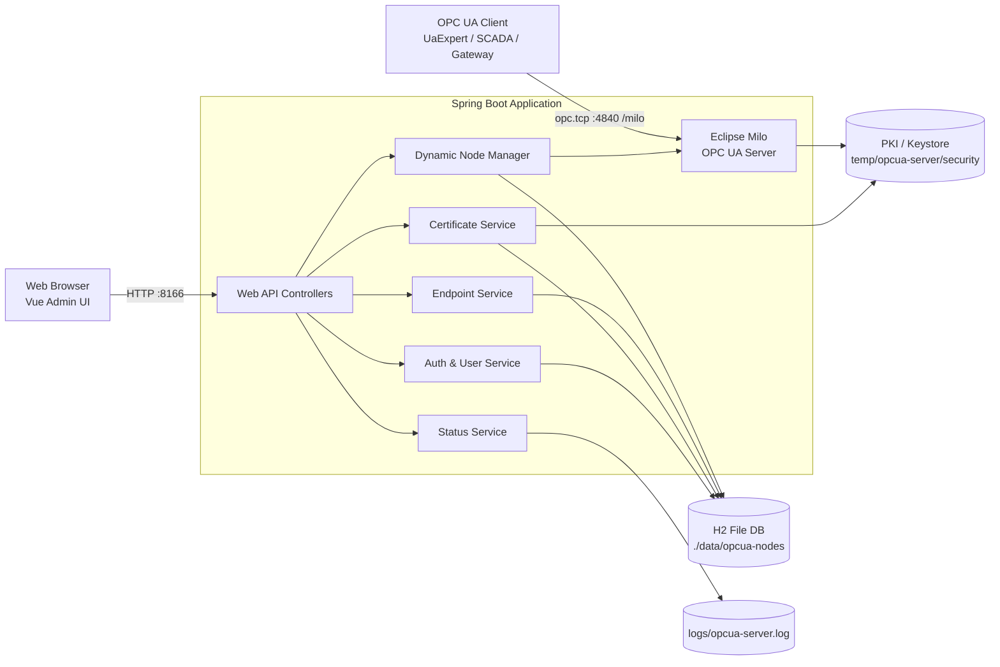
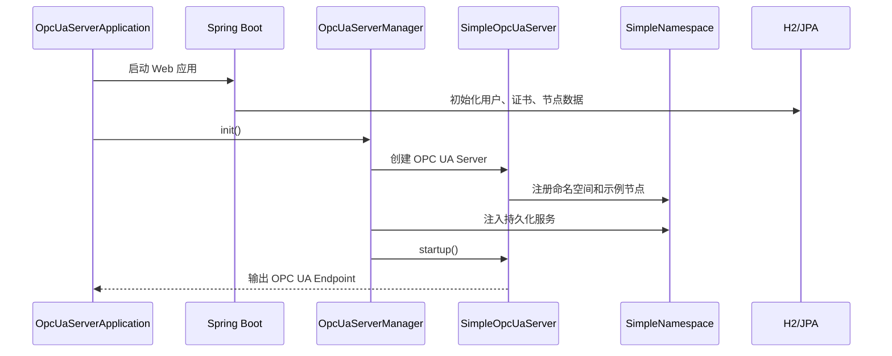

# Java OPC UA Server with Web UI

一个基于 Java 17、Spring Boot 3 和 Eclipse Milo 的 OPC UA Server。它不是只能在控制台里跑起来的 SDK 示例，而是把 OPC UA 服务、节点管理、端点配置、证书管理、用户认证和运行状态监控一起放进了 Web UI。

> 市面上的开源 OPC UA Server 项目里，Java 版本通常更偏底层 SDK、示例工程或命令行服务。这个项目想补上的，是“能让工程师打开浏览器就能管理 OPC UA Server”的那一块空白。

## 项目起源

某个周五晚上，一家制造企业的国产化信创改造进入验收前夜，杨工又被叫回了现场。

新的边缘节点刚从旧服务器迁到国产 CPU 和国产操作系统环境，PLC 正常，网关正常，SCADA 也正常，但客户临时补了一句：“明天验收前，能不能再加几个 OPC UA 节点？证书也要按信创安全要求走可信管理，最好别每次都改代码、重启一堆服务。”

杨工打开 GitHub，搜了一圈 Java OPC UA Server。C/C++ 工具不少，商业软件也成熟，但在信创项目里，团队更希望选择 Java：跨平台、好部署、容易纳入现有 Spring Boot 运维体系，也更方便在国产操作系统和内网环境中交付。可找来找去，开源 Java 项目大多还是 SDK demo：节点写死在代码里，证书要翻目录，用户认证靠改类，端点策略散落在配置和样例中。真正带 UI、能让现场人员点一点就完成节点、证书、用户、端点管理的 Java 开源项目，几乎找不到。

于是这个项目诞生了。

它的目标很朴素：让 Java 版 OPC UA Server 不只属于开发者，也能服务国产化信创改造中的调试工程师、交付工程师和现场运维，让工业协议服务从“能跑”变成“能看、能管、能交付”。

## 核心能力

- Java 17 + Spring Boot 3 后端，一体化启动 Web 管理服务和 OPC UA Server。
- 基于 Eclipse Milo 1.0.0 实现 OPC UA Server。
- 默认 OPC UA TCP 端口 `4840`，Web 管理端口 `8166`。
- Web UI 管理地址空间，支持文件夹、变量、批量节点、变量值、数据类型、引用和浏览。
- 支持端点查看、端点配置、连接测试和配置应用。
- 支持证书列表、信任、拒绝、删除、刷新、扫描和过期统计。
- 支持用户管理、登录认证、Token 校验和认证方式开关。
- H2 文件数据库持久化节点、用户、证书和认证配置。
- 前端基于 Vue 3、Element Plus、Pinia、Vue Router、Vue I18n。

## 技术栈

| 层级 | 技术 |
| --- | --- |
| OPC UA | Eclipse Milo Server SDK |
| 后端 | Java 17, Spring Boot 3.1.5, Spring MVC, Spring Data JPA |
| 数据库 | H2 File Database |
| 前端 | Vue 3, Element Plus, Pinia, Vue Router, Axios, ECharts |
| 构建 | Maven, frontend-maven-plugin, npm |
| 安全 | Bearer Token, OPC UA 用户名/密码、匿名、证书认证策略 |

## 架构图



## 启动流程



## 项目结构

```text
.
├── pom.xml
├── endpoint-config.json
├── README.md
├── frontend/
│   ├── package.json
│   ├── vue.config.js
│   └── src/
│       ├── App.vue
│       ├── main.js
│       ├── router/
│       ├── stores/
│       ├── views/
│       │   ├── LoginView.vue
│       │   ├── OpcuaManager.vue
│       │   ├── Endpoints.vue
│       │   ├── Certificates.vue
│       │   ├── Users.vue
│       │   └── Status.vue
│       └── components/
│           ├── AddFolderDialog.vue
│           ├── AddVariableDialog.vue
│           ├── AttributesPanel.vue
│           ├── ContextMenu.vue
│           ├── EditValueDialog.vue
│           └── MainLayout.vue
└── src/
    ├── main/
    │   ├── java/org/go/show/multiproto/opcuaserver/
    │   │   ├── OpcUaServerApplication.java
    │   │   ├── SimpleOpcUaServer.java
    │   │   ├── SimpleNamespace.java
    │   │   ├── DynamicNodeManager.java
    │   │   ├── server/
    │   │   │   └── OpcUaServerManager.java
    │   │   ├── controller/
    │   │   ├── service/
    │   │   ├── repository/
    │   │   ├── entity/
    │   │   ├── model/
    │   │   ├── dto/
    │   │   ├── config/
    │   │   ├── certificate/
    │   │   └── identity/
    │   └── resources/
    │       ├── application.properties
    │       ├── db/migration/
    │       └── trusted/
    └── test/
        └── java/
```

## 模块说明

| 模块 | 说明 |
| --- | --- |
| `OpcUaServerApplication` | Spring Boot 入口，启动 Web 应用后初始化 OPC UA Server。 |
| `SimpleOpcUaServer` | Eclipse Milo Server 封装，负责证书、端点、安全策略和启动关闭。 |
| `OpcUaServerManager` | OPC UA Server 生命周期管理，提供启动、停止、重启和状态查询。 |
| `SimpleNamespace` | OPC UA 命名空间注册，承载示例节点和动态节点入口。 |
| `DynamicNodeManager` | 动态地址空间管理，支持创建、更新、删除、浏览和持久化节点。 |
| `controller` | Web API 层，提供节点、端点、证书、用户、认证、状态等接口。 |
| `service` | 业务服务层，处理持久化、证书、端点、用户、状态统计等逻辑。 |
| `repository` / `entity` | JPA 数据访问和数据库实体。 |
| `frontend` | Vue 管理端，提供浏览器 UI。 |

## 环境要求

- JDK 17+
- Maven 3.8+
- Node.js 18+ 和 npm 9+，仅当前端单独开发或使用 `with-frontend` 构建时需要

## 快速启动

### 1. 启动后端和 OPC UA Server

如果只想启动 Java 后端、Web API 和 OPC UA 服务，先跳过前端资源复制：

```bash
mvn spring-boot:run -Pskip-frontend
```

启动成功后：

- Web 管理端：`http://localhost:8166`
- OPC UA Endpoint：`opc.tcp://localhost:4840/milo`
- Discovery Endpoint：`opc.tcp://localhost:4840/milo/discovery`
- H2 Console：`http://localhost:8166/h2-console`

H2 默认连接信息：

```text
JDBC URL: jdbc:h2:file:./data/opcua-nodes
User: sa
Password: scy_345
```

### 2. 登录 Web UI

首次启动时，如果数据库没有用户，系统会自动初始化示例账号：

| 用户名 | 密码 | 角色/用途 |
| --- | --- | --- |
| `admin` | `admin123` | 管理员 |
| `operator` | `operator123` | 操作员 |
| `viewer` | `viewer123` | 只读用户 |
| `guest` | `guest123` | 默认禁用 |

> 生产环境请立即修改默认密码，并根据实际安全要求关闭不需要的认证方式。

### 3. 构建完整包

如果已经存在 `frontend/dist`，可以直接使用默认 profile 打包：

```bash
mvn clean package -DskipTests
```

如果要让 Maven 自动安装 Node、安装前端依赖并构建 UI：

```bash
mvn clean package -Pwith-frontend -DskipTests
```

如果只打 Java 后端，不处理前端：

```bash
mvn clean package -Pskip-frontend -DskipTests
```

运行 Jar：

```bash
java -jar target/multiproto-opcuaserver-3.0.1-SNAPSHOT.jar
```

## 前端开发

```bash
cd frontend
npm install
npm run serve
```

前端开发服务默认由 Vue CLI 启动。后端 API 地址由 `frontend/src/utils/request.js` 统一封装；如果本地端口不同，请在该文件或代理配置中调整。

构建前端静态资源：

```bash
cd frontend
npm run build
```

构建产物会生成到 `frontend/dist`，随后可由 Maven profile 复制到 Spring Boot 静态资源目录中。

## 常用接口

| 功能 | 方法 | 路径 |
| --- | --- | --- |
| 登录 | `POST` | `/api/auth/login` |
| Token 校验 | `GET` | `/api/auth/validate` |
| 获取地址空间 | `GET` | `/api/nodes/addressspace` |
| 创建文件夹 | `POST` | `/api/nodes/folder` |
| 创建变量 | `POST` | `/api/nodes/variable` |
| 更新变量值 | `PUT` | `/api/nodes/variable/{path}` |
| 删除节点 | `POST` | `/api/nodes/delete` |
| 批量创建节点 | `POST` | `/api/nodes/batch` |
| 获取活动端点 | `GET` | `/api/endpoints/active` |
| 获取端点配置 | `GET` | `/api/endpoints/config` |
| 应用端点配置 | `POST` | `/api/endpoints/apply` |
| 获取证书列表 | `GET` | `/api/certificates` |
| 信任证书 | `POST` | `/api/certificates/{id}/trust` |
| 拒绝证书 | `POST` | `/api/certificates/{id}/reject` |
| 用户列表 | `GET` | `/api/users` |
| 服务状态 | `GET` | `/api/status/all` |
| 公开健康检查 | `GET` | `/public/health` |
| 公开批量建点 | `POST` | `/public/batch-create-nodes` |

受保护的 API 需要携带登录后返回的 Token：

```bash
curl -H "Authorization: Bearer <token>" http://localhost:8166/api/status/all
```

## OPC UA 连接说明

推荐使用 UaExpert、Milo Client 或 SCADA 客户端连接：

```text
Endpoint: opc.tcp://localhost:4840/milo
Discovery: opc.tcp://localhost:4840/milo/discovery
```

服务端默认创建多种安全策略端点，包括：

- `None / None`
- `Basic128Rsa15 / Sign`
- `Basic256 / Sign`
- `Basic256Sha256 / Sign`
- `Basic128Rsa15 / SignAndEncrypt`
- `Basic256 / SignAndEncrypt`
- `Basic256Sha256 / SignAndEncrypt`
- `Aes128_Sha256_RsaOaep / Sign`
- `Aes128_Sha256_RsaOaep / SignAndEncrypt`
- `Aes256_Sha256_RsaPss / Sign`
- `Aes256_Sha256_RsaPss / SignAndEncrypt`

认证方式由 `AuthMethodService` 管理，支持匿名、用户名/密码和证书认证。新客户端证书首次连接时会被记录为 Rejected，需要在证书管理页面手动信任后再连接。

## 配置说明

主要配置文件：

- `src/main/resources/application.properties`
- `endpoint-config.json`

关键默认值：

```properties
server.port=8166
spring.datasource.url=jdbc:h2:file:./data/opcua-nodes;DB_CLOSE_DELAY=-1;AUTO_SERVER=TRUE;LOCK_TIMEOUT=10000;FILE_LOCK=SOCKET
opcua.persistence.enabled=true
opcua.persistence.auto-save=true
logging.file.name=logs/opcua-server.log
```

运行时数据：

| 路径 | 说明 |
| --- | --- |
| `./data/opcua-nodes.*` | H2 文件数据库 |
| `./logs/opcua-server.log` | 应用日志 |
| 系统临时目录下的 `opcua-server/security` | OPC UA 证书、PKI、信任列表和隔离区 |

## 开发建议

- 新增节点能力优先放在 `DynamicNodeManager`，再由 `NodeController` 暴露 API。
- 新增 UI 页面放在 `frontend/src/views`，公共弹窗和面板放在 `frontend/src/components`。
- 新增持久化对象时按 `entity -> repository -> service -> controller` 的顺序扩展。
- 修改 OPC UA 安全策略、端点和证书逻辑时重点关注 `SimpleOpcUaServer`。
- 修改启动、停止、重启流程时重点关注 `OpcUaServerManager`。
- 与前端联调时先确认后端 `server.port`，再检查 Axios 基础地址或代理配置。

## 测试

后端测试位于 `src/test/java`，包含用户名登录、身份验证、证书认证等用例。

```bash
mvn test -Pskip-frontend
```

常用本地验证顺序：

1. `mvn test -Pskip-frontend`
2. `mvn spring-boot:run -Pskip-frontend`
3. 打开 `http://localhost:8166` 登录管理端
4. 使用 UaExpert 连接 `opc.tcp://localhost:4840/milo`
5. 在 UI 中新增变量，并在 UaExpert 中订阅或读取该变量

## 适用场景

- 工业网关或边缘采集软件需要内置 OPC UA Server。
- 需要快速搭建带 UI 的 OPC UA 地址空间管理工具。
- 需要演示、测试或交付一个可视化 OPC UA Server。
- 希望用 Java 技术栈维护 OPC UA 服务，同时保留 Web 化运维入口。

## 项目定位

这个项目的关键词是：Java、OPC UA Server、可视化管理、工程可交付。

它不是只给开发者看的 demo，也不是只给现场用的黑盒工具。它站在中间：底层用 Java 和 Eclipse Milo 保持可扩展性，上层用 Web UI 降低使用门槛，让 OPC UA Server 从“能跑”进一步变成“能管、能交付、能维护”。
